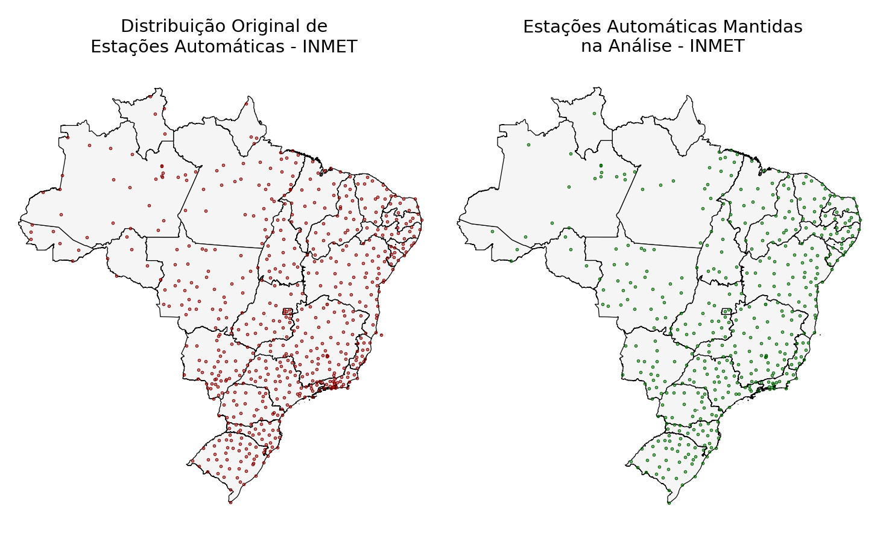
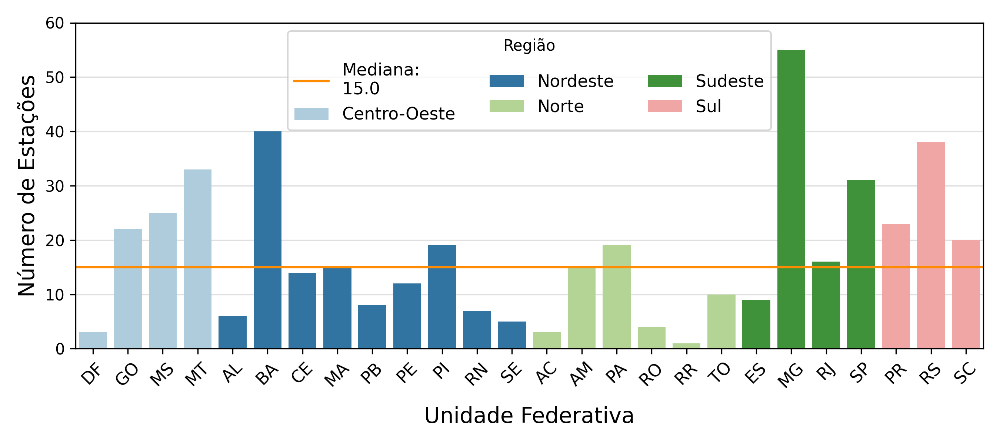
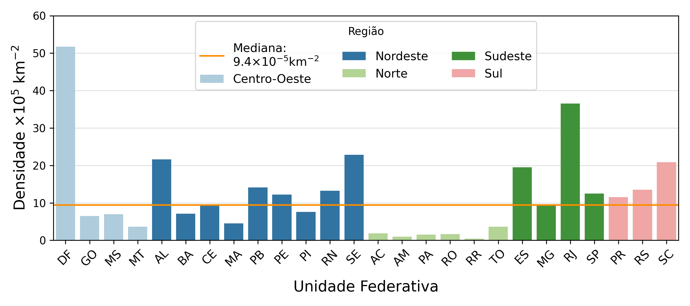
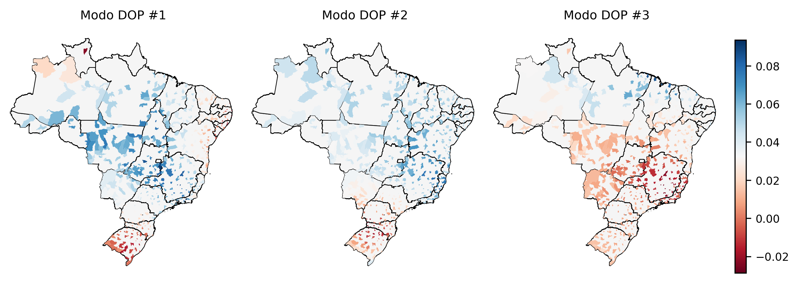
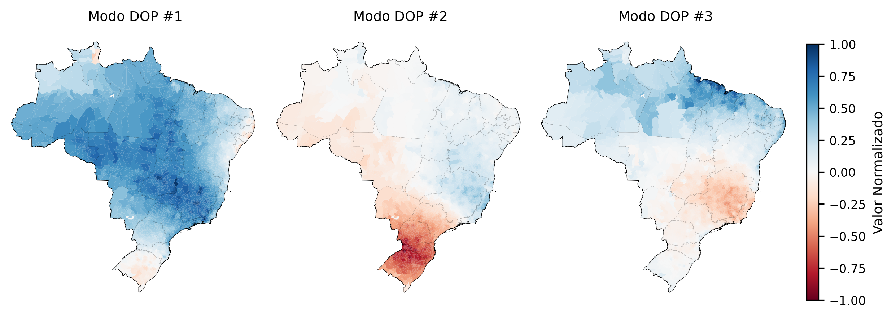
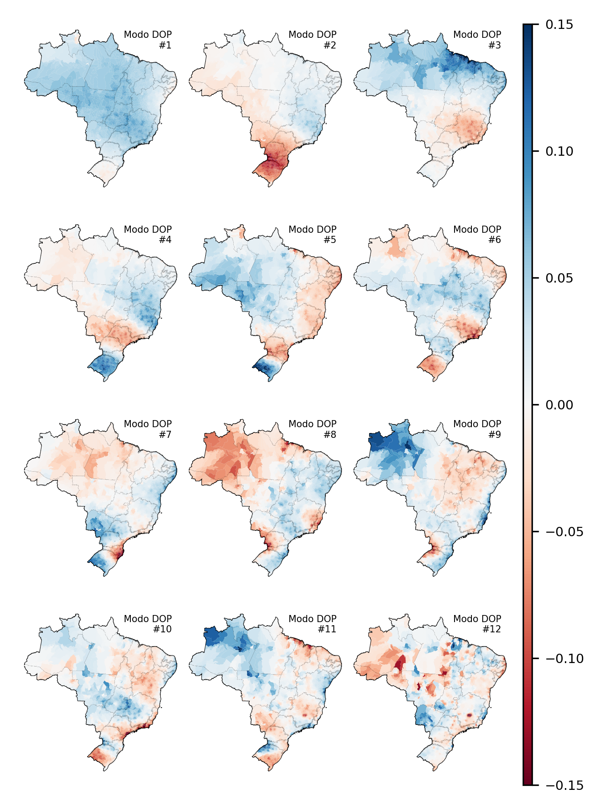
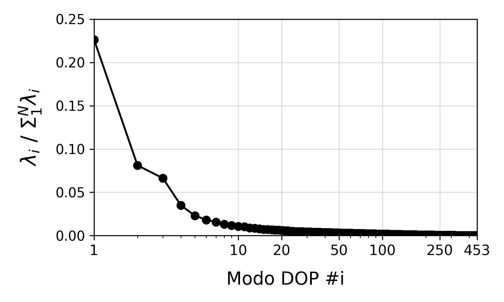
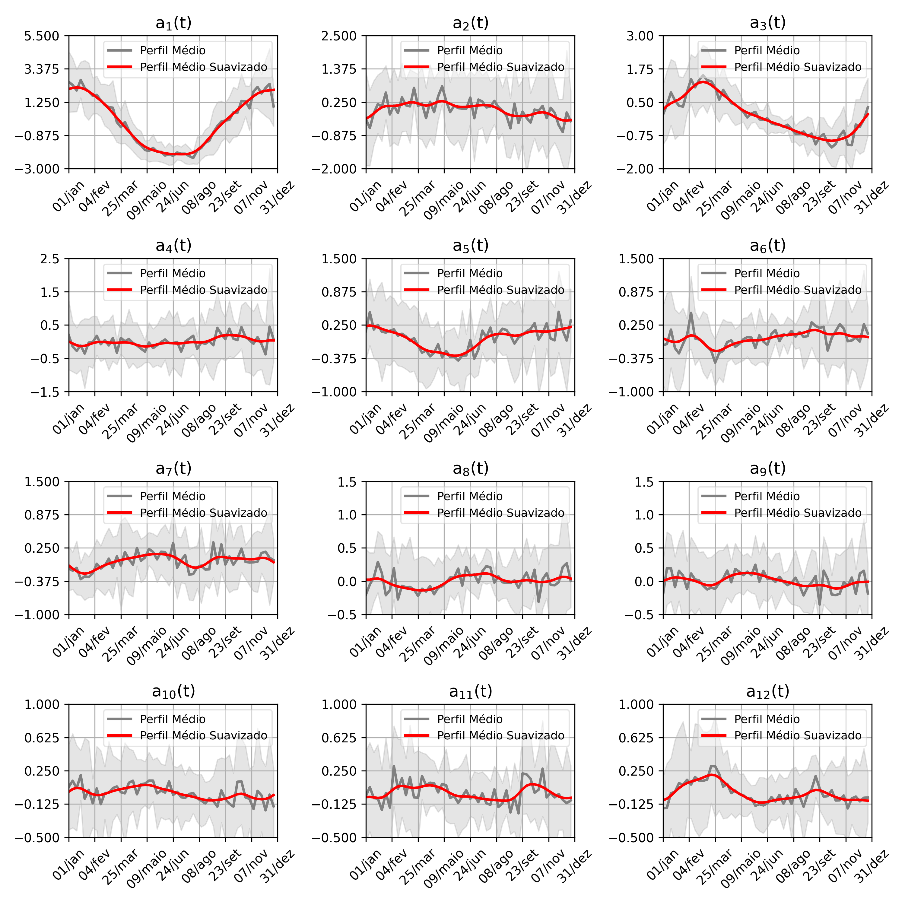
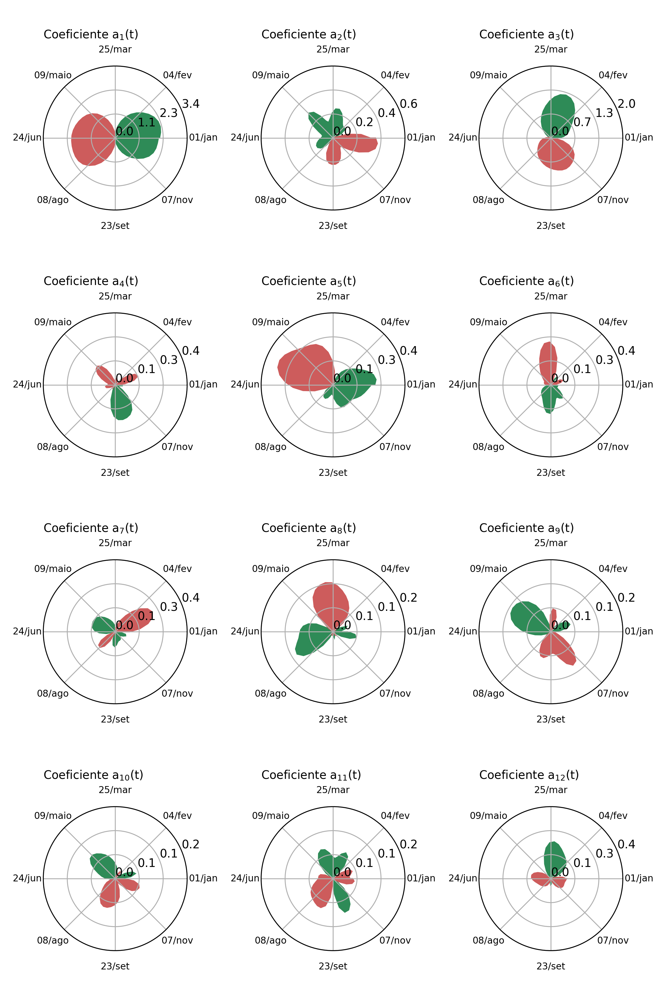
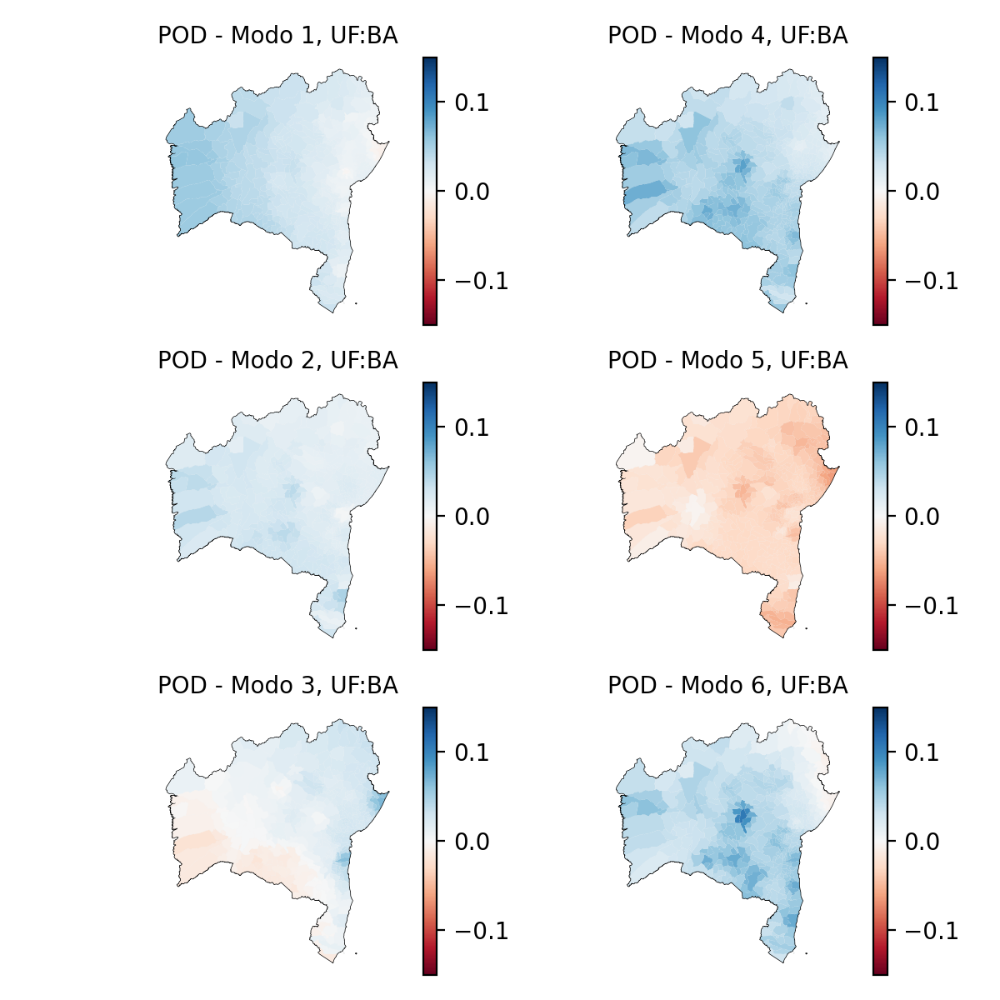

## O Que Se Faz Aqui?
Explora-se o banco de dados meteorológicos do INMET, a partir de dados coletados por cerca de 600 estações distribuídas pelo Brasil para o intervalo de 01-01-2008 a 31-12-2023, inclusos, através do método POD, *Proper Orthogonal Decomposition*

## Por Quê?

O fenômeno das chuvas no Brasil é de grande importância econômica, sendo sua compreensão desafiadora devido à quantidade de variáveis e à complexidade de sua dinâmica. Métodos de decomposição, como a técnica POD, auxiliam na identificação de padrões espaciais de precipitação, simplificando a análise de sistemas dinâmicos.

Outras técnicas, como a **Decomposição Ortogonal Própria Balanceada (DOPB)** e a **Decomposição em Modos Dinâmicos (DMD)**, também são usadas para reduzir a complexidade de sistemas climáticos, facilitando previsões e a gestão de eventos extremos.

## Como?
O procedimento **decompõe** os dados espaciais de chuvas diárias coletadas pelo país para então identificar modos - também espaciais - que possam, em algum nível, levantar informações sobre o fenômeno de chuvas no país.

De maneira simples, o método identifica modos que explicam as oscilações no índice pluviométrico ao longo do país - similarmente aos modos observáveis para uma corda de extremidade fixa - e os associa a coeficientes que ponderam a relevância do modo ao longo do período analisado. 

<!-- Matematicamente, os modos correspondem aos autovetores da matriz de covariância da tabela de chuvas. Já os coeficientes associados, definidos pelo conjunto de autovalores.  

Dada as definições, a distribuição de chuvas pode ser reconstruída a partir dos modos **espaciais**, $M_i({x,y,z})$, e os coeficientes **temporais**,$a_i(t)$, por:

$$ C({x,y,z},t) = \overline{S({x,y,z})} + \sum_{i=1}^{n} a_i(t) M_i({{x,y,z}}),$$

em que $C({x,y,z},t)$ é o índice pluviométrico na posição $(x,y,z)$ e tempo $t$, e $\overline{S({x,y,z})}$, a distribuição espacial média calcualda sobre todo o período.  -->

### Parte 1 - Dados de Chuva e Tratamento

Os dados pluviométricos, referentes ao período de 01-01-2008 a 31-12-2023, foram obtidos no **INMET** e incluem registros horários de 614 estações meteorológicas. Esses dados também contêm medidas de temperatura, pressão atmosférica, umidade, radiação e velocidade do vento, com geolocalização das estações.

Na primeira etapa, os dados de chuva foram agrupados em uma tabela com estações nas colunas e registros horários nas linhas. As estações com inconsistências foram removidas, reduzindo o número para 447. A geolocalização dessas estações foi comparada aos dados do **IBGE**, que indicam que 11% dos municípios possuem ao menos uma estação meteorológica.

Para preencher valores faltantes ou discrepantes, aplicou-se uma interpolação ponderada usando a distância quadrática entre estações vizinhas. Foi fixado um parâmetro `p = 2`, equação abaixo, dando maior peso às estações mais próximas. Devido à esparsidade dos dados, as medições horárias foram transformadas em registros semanais de chuva acumulada, aumentando a estabilidade e a sensibilidade do método aplicado.

A interpolação ponderada foi realizada com base na seguinte equação:

\[
c(\vec{x}_j, t) = \frac{\sum_{i=1}^{30} c(\vec{x}_i, t) . d(\vec{x}_j, \vec{x}_i)^{-p}}{\sum_{i=1}^{30} {d(\vec{x}_j, \vec{x}_i)^{-p}}} \tag{1}
\]

Onde:
- \( c(\vec{x}_j, t) \) é o índice pluviométrico da estação \( \vec{x}_j \) no instante \( t \);
- \( d(\vec{x}_j, \vec{x}_i) \) é a distância entre a estação \( \vec{x}_j \) e sua vizinha \( \vec{x}_i \);
- \( p \) é um parâmetro positivo que regula o peso dado à distância, sendo fixado em \( p = 2 \).

### Parte 2 - O Cálculo

#### Técnica DOP

A **Decomposição Ortogonal Própria (DOP)** é uma técnica poderosa utilizada na análise de sistemas dinâmicos complexos, especialmente em problemas fluidodinâmicos. Ela se destaca por identificar e isolar estruturas relevantes de um sistema dinâmico, permitindo a decomposição em modos ortogonais e a redução da complexidade do problema. A técnica é útil para encontrar estruturas coerentes subjacentes ao fenômeno estudado, mesmo quando estas não são facilmente identificáveis.

#### Aplicação aos Dados de Chuva

A aplicação da DOP sobre os dados de chuva resulta na identificação de mapas modais que explicam o perfil espacial de precipitações. A relação é dada pela seguinte aproximação:

\[
\widehat{c\left(\vec{x};t\right)}_k = \bar{c\left(\vec{x}\right)} + \sum_{i=1}^{N} a_i(t) M_i\left(\vec{x}\right) \tag{2}
\]

Onde:
- \(\widehat{c\left(\vec{x};t\right)}_k\) é uma estimativa para \(c\left(\vec{x};t\right)\);
- \(\bar{c\left(\vec{x}\right)}\) é o campo de precipitação médio na posição \(\vec{x}\);
- \(M_i\left(\vec{x}\right)\) são os modos espaciais que estabelecem correlações em diferentes regiões;
- \(a_i(t)\) é o coeficiente temporal que pondera a contribuição do modo \(M_i\) no instante \(t\);
- \(N\) é o número total de modos identificados.

Os modos são ordenados por sua capacidade de capturar a variância dos dados originais, com os primeiros modos sendo os que melhor aproximam a estimativa \(\widehat{c\left(\vec{x};t\right)}_n\) do valor real \(c\left(\vec{x};t\right)\).

### Procedimentos da DOP

1. **Preparação dos Dados**: 
   Os dados de precipitação semanal foram organizados em uma matriz \(I\), onde as linhas representam as estações meteorológicas e as colunas, as semanas do período estudado.

2. **Identificação das Anomalias**: 
   Para cada estação, a média de precipitação foi calculada e subtraída dos dados, resultando em uma matriz de anomalias \(A\).

3. **Cálculo da Matriz de Covariância**: 
   A matriz de covariância \(C\) é definida como:
   \[
   C = \frac{1}{m - 1} A^T A \tag{3}
   \]
   Onde \(m\) é o número de mapas de chuvas usados na análise.

4. **Cálculo dos Modos da Matriz de Chuvas**: 
   Os autovetores e autovalores da matriz \(C\) foram calculados. Os autovetores fornecem os modos \(M_i\) e os autovalores \(\lambda_i\) indicam a variância explicada por cada modo.

5. **Cálculo dos Coeficientes Temporais**: 
   Os coeficientes temporais são calculados pela equação:
   \[
   a_i(t) = A M_i \tag{4}
   \]

### Complementação dos Dados

No tratamento dos dados, o número total de estações foi reduzido a **447**, distribuídas por todo o território nacional. Os modos DOP correspondem a mapas modais com 447 elementos, cada um referente às localizações das estações iniciais.

Para melhorar a visualização e interpretação dos resultados, foram realizados dois processamentos finais:

1. **Extrapolação Territorial**: 
   Os valores de cada modo foram extrapolados para representar não apenas as estações, mas também os municípios que as contêm. Esse procedimento manteve a dimensão inicial de cada modo, estendendo os resultados para todo o território.

2. **Estimativa de Modos para Municípios Sem Estações**: 
   Os modos foram estimados para todos os municípios que não possuem uma estação meteorológica, utilizando interpolações ponderadas semelhantes à apresentada pela equação (1). Agora, cada modo possui **5570 elementos**, correspondendo a todos os municípios brasileiros.

## Resultados 

### Localização das Estações

A análise inicial indicou um total de **614 estações automáticas** localizadas ao longo do território nacional. Contudo, 167 estações apresentaram inconsistências nos dados e foram removidas. Assim, restaram **447 estações**.

 
**Figura 1**: Distribuição das estações meteorológicas automáticas do INMET. À esquerda, a distribuição de estações identificadas (01-01-2008 a 31-12-2023); à direita, as estações mantidas após o tratamento de dados.

As estações mantidas estão principalmente na porção leste do país, próximas ao litoral, com uma densidade aproximadamente constante. A **Figura 2** mostra a distribuição de estações mantidas por estado, destacando que os estados da região Norte são os menos representados.

 
**Figura 2**: Número de estações automáticas por estado e região.

Em termos de densidade por área territorial, a representatividade da região Norte é ainda menor. A **Figura 3** ilustra que nenhum estado da região atinge a mediana das densidades, apesar de sua importância no ciclo hídrico. Assim, os resultados obtidos terão impacto reduzido nessa região, que corresponde a cerca de **45%** da área total do Brasil.

 
**Figura 3**: Densidade de estações automáticas por estado e região; em amarelo, destaca-se a mediana calculada.

### Modos Identificados

Um total de **453 modos** foi calculado. Os mapas dos três primeiros modos estão ilustrados na **Figura 4**, que extrapola os resultados obtidos para as estações para os municípios.

 
**Figura 4**: Ilustração dos três primeiros modos DOP calculados para a distribuição de chuvas no Brasil.

A interpolação dos modos para todos os municípios levou à construção da **Figura 5.1**, que ilustra a relevância dos modos identificados. Quando duas regiões exibem cores opostas, há uma correlação negativa entre as intensidades de chuvas, indicando que quando uma região apresenta um índice de chuva acumulada distante da média, a outra também apresenta um índice distante, mas em sentido oposto. O total de 12 modos pode ser visto na **Figura 5.2**.

 
**Figura 5.1**: Ilustração dos três primeiros modos DOP interpolados para todos os municípios do país.

O **primeiro modo**, considerado dominante, indica correlação positiva para grande parte do país, exceto pelo Rio Grande do Sul, a região costeira e o extremo norte de Roraima. Isso sugere que o país experimenta, majoritariamente, uma alteração igual no índice de chuvas em torno do valor médio. Os dois modos seguintes destacam padrões regionais próprios.

 
**Figura 5.2**: Ilustração dos doze primeiros modos DOP interpolados para todos os municípios do país.

Os **autovalores** dos modos foram calculados para mensurar sua importância na composição do mapa de chuvas nacional. A **Figura 6** apresenta o autovalor normalizado para todos os modos, onde o modo dominante explica cerca de **23%** da variância dos dados, seguido do segundo e terceiro modos, que explicam **7%** e **6%**, respectivamente.

**Figura 6**: Espectro de autovalores normalizados para os modos DOP calculados.

A curva acumulada de autovalores normalizados, mostrada na **Figura 7**, indica que os **10 primeiros modos** explicam aproximadamente **50%** da variância total, aumentando para **70%** ao considerar **50 modos**.

**Figura 7**: Variância normalizada explicada pela composição dos primeiros modos \(k\).

### Coeficientes Associados

Os modos identificam os padrões de variação das chuvas ao longo do período de análise, enquanto os **coeficientes temporais** ponderam a influência de cada modo na reconstrução da distribuição espaço-temporal das chuvas. 

A **Figura 8.1** resume os coeficientes correspondentes aos modos da **Figura 5.1** para todos os anos analisados, sugerindo uma periodicidade anual. Os coeficientes devem ser interpretados em conjunto com seus respectivos modos.

Na figura, a área em cinza representa um desvio padrão em relação ao coeficiente médio, enquanto a linha vermelha destaca um perfil suavizado.

**Figura 8.1**: Evolução temporal dos coeficientes dos três primeiros modos DOP.

A **Figura 8.2** a seguir resume os doze coeficientes correspondentes aos modos da **Figura 5.2** para todos os anos analisados.

**Figura 8.2**: Evolução temporal dos coeficientes dos doze primeiros modos DOP.

### Redução de Ordem
A partir dos resultados, pode-se afirmar que a distribuição de anomalias de chuvas nacional acumulada em uma semana t, ou o quanto a distribuição espacial se desvia da média, é dada pelo produto $a_1(t)M_1$ em uma primeira aproximação. Quanto mais modos são adicionados, mais complexa se torna a distribuição. 

Modelos matemáticos de previsão, por exemplo, podem se comprometer a explicar os K primeiros modos, por exemplo. 

### Outras Formas de apresentação dos Coeficientes Associados

##### Representação Polar 
A **Figura 9** representa na forma polar temporal a evolução de doze dos coeficientes associados médios para todo o período. O raio representa a magnitude do coeficiente, que é colorido em verde para o intervalo em que os coeficiente são positivos e em vermelho quando negativos. A representação permite a fácil e rápida comparação entre os modos.

**Figura 9**: Representação polar-temporal dos coeficientes associados dos doze primeiros modos. 

Há, ainda, a representação no espaço de fases dos coeficientes, onde um coeficiente pode ser expresso contra os outros coeificientes. A Figura **Figura 10** mostra essa representação, que torna implícita a variável temporal. 

**Figura 10**: Representação em espaço de fases dos coeficientes com relação ao coeficiente 3 $a_3(t)$.  

### Olhando Para os Modos a Nível Estadual

#### Bahia

A **Figura 11** ilustra os seis primeiros modos identificados com representação restrita ao estado da Bahia. Os resultados indicam, ao menos aos seis primeiros modos, a tendência de todo o território baiano apresentar o mesmo tendência de chuvas quando comparado ao país. 

**Figura 11**: Modos de 1 a 6 identificados para o estado de Minas Gerais. 

#### Minas Gerais

A **Figura 12**, por sua vez, ilustra os seis primeiros modos identificados com representação restrita ao estado de Minas Gerais. Segundo mostram as imagens, o estado apresenta uma dinâmica de chuvas cujas magnitudes são comparáveis as magnitudes da dinâmica nacional. Esse resultado sugere o estado como um termômetro para a dinâmica nacional de chuvas. 

**Figura 12**: Modos de 1 a 6 identificados para o estado de Minas Gerais. 