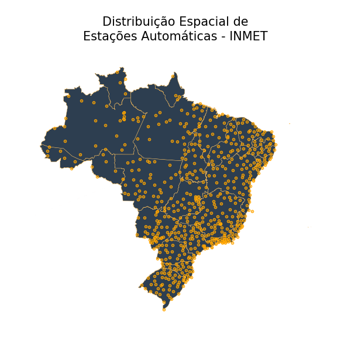
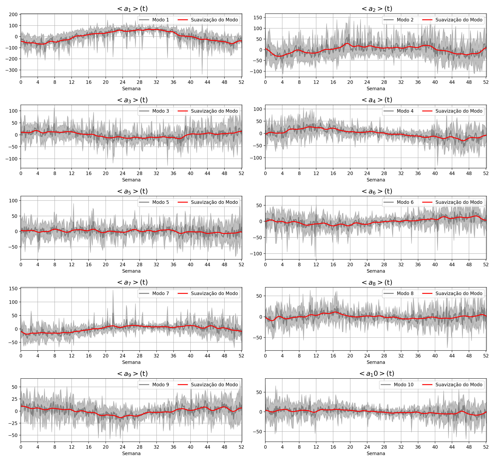
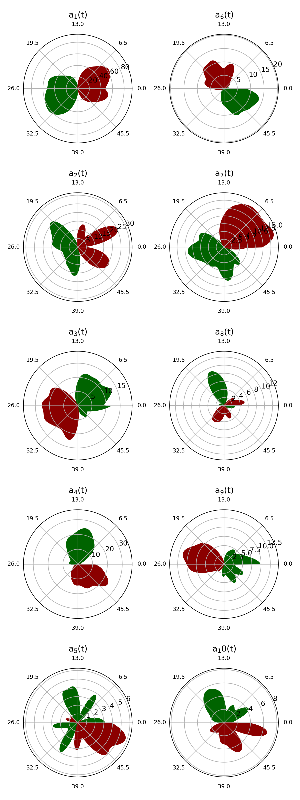

## O que se faz aqui?
Explora-se o banco de dados meteorológicos do INMET, a partir de dados coletados por cerca de 600 estações distribuídas pelo Brasil entre os anos de 2013 a 2022, através do método POD, *Proper Orthogonal Decomposition*.

## Como?
O procedimento **decompõe** os dados espaciais de chuvas diárias coletadas pelo país para então identificar modos - também espaciais - que possam, em algum nível, levantar informações sobre o fenômeno de chuvas no país.

De maneira simples, o método identifica modos que explicam as oscilações no índice pluviométrico ao longo do país - similarmente aos modos observáveis para uma corda de extremidade fixa - e os associa a coeficientes que ponderam a relevância do modo ao longo do período analisado. 

Matematicamente, os modos correspondem aos autovetores da matriz de covariância da tabela de chuvas. Já os coeficientes associados, definidos pelo conjunto de autovalores.  

Dada as definições, a distribuição de chuvas pode ser reconstruída a partir dos modos **espaciais**, $M_i({x,y,z})$, e os coeficientes **temporais**,$a_i(t)$, por:

$$ C({x,y,z},t) = \overline{S({x,y,z})} + \sum_{i=1}^{n} a_i(t) M_i({{x,y,z}}),$$

em que $C({x,y,z},t)$ é o índice pluviométrico na posição $(x,y,z)$ e tempo $t$, e $\overline{S({x,y,z})}$, a distribuição espacial média calcualda sobre todo o período. 

## Parte 1 - Tratamento de dados
*obs: não consegui usar api's do inmet*

Nessa etapa, os dados de índice pluviométrico são identificados e associados à sua localização (latitude e longitude). Em seguida, um processo de tratamento de dados altera os dados com valores negativos ou NaNs de uma dada localização pela média dos índices das estações vizinhas, ponderada pelo inverso do quadrado da distância.    

A localização das estações utilziadas podem ser vistas na figura 1 abaixo.

 

Fig 1 - Localização das estações do INMET.

## Parte 2 - O Cálculo
Aqui, parte-se dos dados temporais de indíce pluviométrico tratados na parte 1. Os dados, embora localizados espacialmente, serão associados a cidade local da estação para melhor visualização dos modos. 

Os dados de chuva, agora, correspondem a uma matriz cujas linhas representam o tempo, e as colunas o respaço. Em seguida calcula-se a matriz de covariância desses dados, seguido do cálculo de autovetores, que agora representam os modos POD de interesse.   

Por fim, usa-se de interpolação para estimar informação sobre as cidades que não possui uma estação em seu território. 
## Resultados

#### TKE
Os resuldados levaram a identificação de muitos modos, devido à alta dimensão da matriz de dados. A figura 2 abaixo mostra a importância de cada modo a partir do índice TKE, que representa o valor do autovalor associado normalizado pela soma de todos autovalores. Vê-se, por exemplo, que o primeiro modo é aproximadamente "duas vezes mais importante" que o segundo modo. 

A figura 2 c) ilustra que somente se é capaz de explicar a totalidade dos dados de chuva se todos os modos forem adicionados. Contudo, vale dizer, que os modos mais altos não necessariamente implicam em fenômenos reais, mas à identificação de correlações fracas a nível de ruído presentes nos dados. 

Fig 2 - Plots de TKE a) TKE para todos os modos, b) TKE para os modos até 20, c) TKE acumulado do TKE.

#### Modos BR

A figura 3 ilustra os modos identificados. No que diz respeito à coloração utilizada, afirma-se que quando dois municípios apresentam cores inversas, diz-se que tais município possui correlação negativa quanto à variação de chuva, ou melhor, quando um dos municípios apresentam aumento no indice de chuvas, o outro apresenta diminuição, e vice-versa. Aqui, azul e vermelha representam cores opostas.

Nota-se que o Modo 1, de maior predominância, indica que o país inteiro possui uma correlação positiva (mesma cor), sugerindo que o país experimenta, primariamente, o aumento de chuvas como um todo. 

O segundo Modo, por sua vez, demonstra uma correlação negativa mais intensa entre a região sul e grande porção central do país. 

Os modos de 3 a 10 ainda ilustram outras particularidades no fenômeno de chuva do país.

Fig 3 - Modos de 1 a 10 identificados para o Brasil.

##### Os Coeficientes - BR
Os modos vistos acima, embora compreendam parte do espaço de "distribuição espacial de chuvas" que poderiam explicar os fenômenos de chuva, não nos informam a participação de cada modo ao longo do tempo.

Mais explicitamente, a distribuição espaço-temporal de chuvas é a combinação linear de modos **espaciais** ponderados por coeficientes **temporais** que 'medem' a importância de cada modo ao longo do tempo. O procedimento é uma abordagem baseada na separação de variáveis. 

O coeficiente temporal relativo ao modo 6, por exemplo, varia ao longo do ano ponderando a participação do modo 6 na distribuiçao de chuvas no período sob análise. Para reconstruir a distribuição de chuvas em um instante qualquer basta multiplicar o conjuntos de coeficientes por seus modos correspondentes e somar os resultados:

$$ C({x,y,z},t) = \overline{S({x,y,z})} + \sum_{i=1}^{n} a_i(t) M_i({{x,y,z}}),$$

A figura 4, abaixo, reduz a um ano os coeficientes correspondentes ao período de 10 anos. O gráfico é interessante para se identifcar periodicidade anual. A região em cinza cobre um desvio padrão com relação ao coeficiente médio calculado para a o instante aassociado. O eixo horizontal tá em expresso em semanas.

A magnitude dos coeficientes podem variar de positivo para negativo indicando uma inversão nos fenômenos de estiagem para chuva e vice-versa. A figura ainda mostra um perfil processado por filtro gaussiano para destaque da tendência principal de cada coeficiente. 

Fig 4 - Modos de 1 a 10 identificados para o Brasil.

A figura 5 apresenta ainda o perfil destacado para cada modo na forma polar para uma melhor visualização dos ciclos. Os ângulos representam as semanas do ano, enquanto o raio representa a magnitude do coeficiente. Valores negativos e positivos para os coeficientes estão representados nas cores verde e vermelho.  

Fig 5 - Modos de 1 a 10 identificados para o Brasil.

#### Olhando Para os Modos a Nível Estadual -  MG

A figura 6 ilustra os seis primeiros modos identificados para o estado de Minas Gerais, exclusivamente. Seu posicionamento é capaz de ilustrar, já localmente, as presença de correlações na mesma magnitude que a nacional. 

Fig 6 - Modos de 1 a 6 identificados para o estado de Minas Gerais.

#### Referências:
- [Banco de Dados do INMET](https://portal.inmet.gov.br/dadoshistoricos)
- [IBGE](https://www.ibge.gov.br/geociencias/organizacao-do-territorio/malhas-territoriais/15774-malhas.html)
- [A Tutorial on the Proper Orthogonal Decomposition](https://arc.aiaa.org/doi/10.2514/6.2019-3333)
