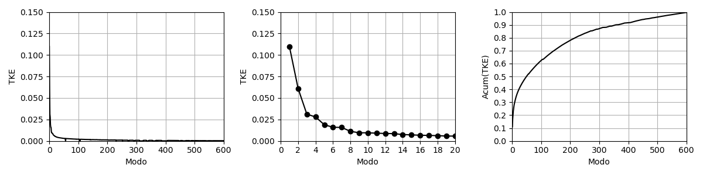
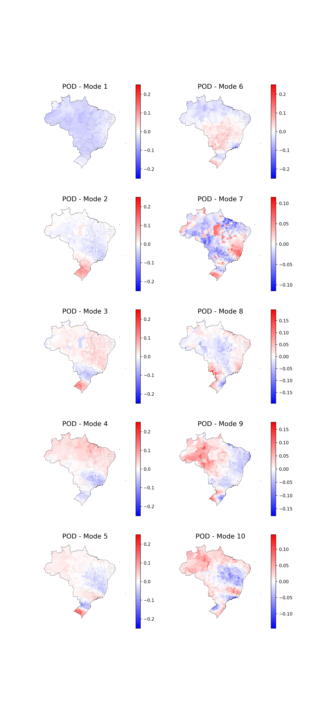
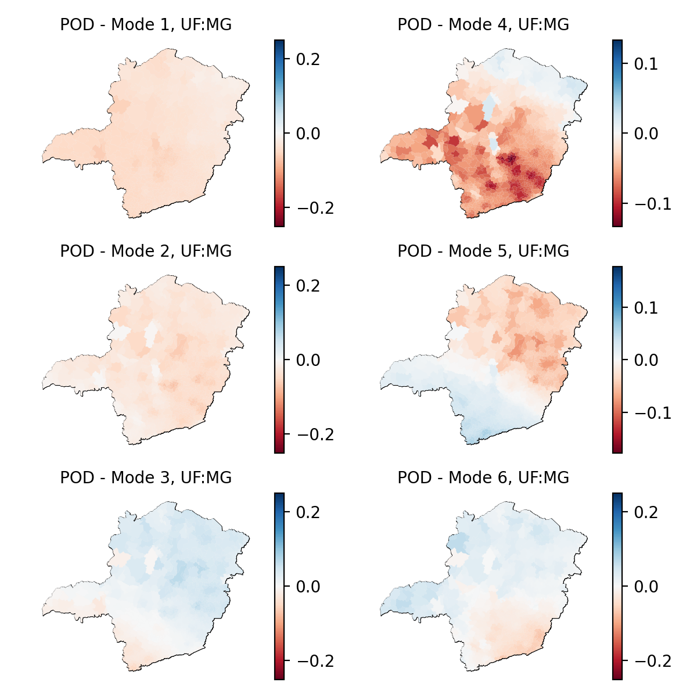

## O que se faz aqui?
Explora-se o banco de dados meteorológicos do INMET, a partir de dados coletados por cerca de 600 estações distribuídas pelo Brasil entre os anos de 2013 a 2022, através do método POD, *Proper Orthogonal Decomposition*.

## Como?
O procedimento **decompõe** os dados espaciais de chuvas diárias para identificação de modos - também espaciais - que possam, em algum nível, levantar informações sobre fenômeno de chuvas no país.

De maneira simples, o método identifica se há correlação entre os índices pluviómetricos em todo o país, identifica os modos como essas correlações ocorrem e dão um "peso" a cada modo. Matematicamente, os modos correspondem ao autovetores da matriz de correlação da tabela de chuvas e suas relevâncias, ou pesos, são definidos pelo conjunto de autovalores associado.  

## Resultados

#### TKE
Os resuldados levaram a identificação de muitos modos, devido à alta dimensão da matriz de dados. A figura abaixo mostra a importância de cada modo a partir do índice TKE, que representa o autovalor, relativo à soma dos autovalores, do modo correspondente. Nota-se que o primeiro modo é "duas vezes mais importante" que o segundo modo. 

A figura 1 c) ilustra que somente se é capaz de explicar a totalidade dos dados de chuva se todos os modos forem adicinados. Contudo, vale dizer, que os modos mais altos não necessariamente implicam em fenômenos reais, mas a reprodução de 'ruídos' dos dados. 

Fig 1 - Plots de TKE a) TKE para todos os modos, b) TKE para os modos até 20, c) TKE acumulado do TKE.

#### Modos BR

A figura 2 ilustra os modos identificados. No que diz respeito à coloração utilizada, afirma-se que quando dois municípios apresentam cores inversas, diz-se que tais município possui correlação negativa quanto à variação de chuva, ou melhor, quando um dos municípios apresentam aumento de chuva, o outro apresenta diminuição, e vice-versa. Aqui, azul e vermelha representam cores opostas.

Nota-se que o Modo 1, de maior predominância, indica que o país inteiro possui uma correlação positiva (mesma cor), sugerindo que o país experimenta, primariamente, o aumento de chuvas como um todo. 

O segundo Modo, por sua vez, demonstra uma correlação negativa entre a região sul e grande porção central do país. 

Os modos de 3 a 10 ainda ilustram outras particularidades no fenômeno de chuva do país.

Fig 2 - Modos de 1 a 10 identificados para o Brasil.

#### Modos MG

A figura 3 ilustra os seis primeiros modos identificados para o estado de Minas Gerais, exclusivamente. Seu posicionamento é capaz de ilustrar, já localmente, as presença de correlações na mesma magnitude que a nacional. 

Fig 3 - Modos de 1 a 6 identificados para o estado de Minas Gerais.

#### Referências:
- [Banco de Dados do INMET](https://portal.inmet.gov.br/dadoshistoricos)
- [IBGE](https://www.ibge.gov.br/geociencias/organizacao-do-territorio/malhas-territoriais/15774-malhas.html)
- [A Tutorial on the Proper Orthogonal Decomposition](https://arc.aiaa.org/doi/10.2514/6.2019-3333)